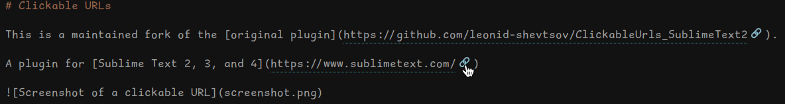

# Clickable URLs

This is a maintained fork of the [original plugin](https://github.com/leonid-shevtsov/ClickableUrls_SublimeText2).

A plugin for [Sublime Text 2, 3, and 4](https://www.sublimetext.com/)

## Summary

This plugin underlines URLs in Sublime Text, and lets you open them with a keystroke (`Cmd+Option+Enter` by default) or a single click (opt-in, see `open_on_click` below).

After you put the cursor over an URL, you can either hit `Cmd+Option+Enter` (`Ctrl+Alt+Enter` on Windows & Linux), or select "Open URL under cursor" from the Command Palette. Instead of selecting an auto detected URL, you can select any block of text and it will also open in a browser as a URL.

There is also an "Open all URLs" command, which opens all URLs found in the current document.

**Performance warning.** The plugin is automatically disabled if the document has more than 200 URLs, in order to avoid a massive performance hit. To change this number, set the `max_url_limit` option (see "Configuration" below).

## Installation

With [Package Control](https://packages.sublimetext.io/) (open Command Palette(ctrl+shift+p), find `Package Control: Install Package`, search for `Clickable Urls`, hit enter), or just drop the plugin into Sublime Text's Packages folder.

## Configuration

All configuration is done via the settings file that you can open via the main menu: `Preferences > Package Settings > Clickable URLs > Settings - User`.

### Customising the browser

By default, Clickable URLs uses some default system browser. If it doesn't work for you, you can change the browser by setting the `clickable_urls_browser` in the `ClickableUrls.sublime-settings`
file, to which you can get from the menu.

Anything from [this list](https://docs.python.org/2/library/webbrowser.html#webbrowser.register) will work, for example:

    {
        "clickable_urls_browser": "firefox"
    }

**Note for Windows users.** If the browser you want won't open, you might have to specify the full path manually:

    {
        "clickable_urls_browser": "\"c:\\program files\\mozilla firefox\\firefox.exe\" %s &"
    }

Take note of the escaped slashes and the quoting around the name.

The ampersand at the end is significant - without it the editor will hang and wait for browser to close.

### Disabling URL highlighting

Unfortunately, the only way to underline a block of text in Sublime Text 2 is a hack with underlining empty regions, and there is no way to control its appearance. If you want, you can disable URL highlighting by setting the option `highlight_urls` to false.

    {
        "highlight_urls": false
    }

Note that this isn't an issue with Sublime Text 3.

### Opening URLs with a single click

By default, URLs open via the keyboard shortcut. To enable single left-click to open, set `open_on_click` to true:

    {
        "open_on_click": true
    }

A 300ms delay is used to distinguish between a single click and a double (triple) click. Any drag or text selection cancels the pending open.

### Customising the underline color

By default, the underline color matches the lexical scope color of each URL. You can override this with a fixed scope color by setting `underline_color`:

    {
        "underline_color": "string"
    }

Any valid scope name works (e.g. `"region.bluish","region.greenish","region.yellowish"`).

### Customising the underline style

The underline style can be changed from the default `solid` to `stippled` or `squiggly`:

    {
        "underline_style": "squiggly"
    }

Valid values are `"solid"`, `"stippled"`, and `"squiggly"`. This setting only applies to Sublime Text 3 and later.

### Showing a clickable phantom icon next to each URL

An icon can be shown after each URL, the cursor changes to a pointer when you hover over the icon:

    {
        "show_phantom": true,
        "phantom_icon": "⮊",
        "phantom_color": "blue",
        "phantom_size": "0.8em"
    }

Clicking the icon opens the URL in your browser (same as using the keyboard shortcut).

## Known Issues

* URLs are not underlined in Markdown files when using the [MarkdownEditing plugin](https://github.com/SublimeText-Markdown/MarkdownEditing) plugin (that plugin applies its own styles to the URLs). Otherwise ClickableUrls works as usual.

---

(c) 2015 [Leonid Shevtsov](http://leonid.shevtsov.me) under the MIT license.
